# EcuadorComparte

Plataforma web informativa y de contacto para la organización Ecuador Comparte.

---

## URL del Repositorio GitHub

https://github.com/Sergio-Avv/EcuadorComparte
---

## Descripción del Proyecto

**EcuadorComparte** es una aplicación web desarrollada con Spring Boot que actúa como plataforma informativa y de contacto para la organización Alianza Ecuador. El sistema permite publicar noticias, recoger testimonios de la comunidad, gestionar solicitudes de contacto ciudadanas y generar reportes automáticos semanales por correo electrónico.
 
### Funcionalidades principales

- Página de inicio pública con noticias publicadas, testimonios y formulario de contacto.
- Página "Sobre Nosotros" con información institucional de la organización.
- Módulo de noticias con listado y vista de detalle para usuarios públicos.
- Módulo de testimonios accesible al público general.
- Formulario de contacto con múltiples propósitos de comunicación.
- Panel de administración protegido con autenticación para gestionar noticias, testimonios y solicitudes de contacto.
- Exportación de datos a Excel (noticias, testimonios, solicitudes de contacto).
- Envío automático de reportes semanales por correo electrónico mediante un scheduler.
- Seguridad basada en roles implementada con Spring Security.
- Inicialización automática de datos de prueba con scripts SQL al arrancar la aplicación.

### Usuarios objetivo

- **Ciudadanos ecuatorianos** que deseen informarse sobre la organización, leer noticias, ver testimonios y ponerse en contacto.
- **Administradores** de la organización que gestionan el contenido del sitio y revisan las solicitudes recibidas.

---

## Pasos para Correr el Proyecto

### Requisitos previos

| Herramienta       | Versión recomendada        |
|-------------------|---------------------------|
| Java JDK          | 21                        |
| Gradle            | Incluido (wrapper)        |
| PostgreSQL        | 14 o superior             |
| IntelliJ IDEA     | 2023+ (recomendado)       |

### 1. Clonar el repositorio

```bash
git clone https://github.com/Sergio-Avv/ecuador-comparte.git
cd DesarrolloEmpresarial/Ecuador1
```

### 2. Configurar la base de datos PostgreSQL

Crea la base de datos en PostgreSQL:

```sql
CREATE DATABASE "ecuador-comparte-db";
```

### 3. Configurar variables de entorno / application.properties

El archivo de configuración se encuentra en `src/main/resources/application.properties`:

```properties
spring.datasource.url=jdbc:postgresql://localhost:5432/ecuador-comparte-db
spring.datasource.username=postgres
spring.datasource.password=123456789
```

> Ajusta el usuario y contraseña de PostgreSQL según tu entorno local.

> **Nota:** La aplicación ejecuta automáticamente los scripts `schema.sql` y `data.sql` al iniciar, por lo que las tablas y datos de prueba se crean sin intervención manual.

### 4. Configuración de correo (opcional)

Si deseas habilitar el envío de reportes semanales por correo, configura las credenciales SMTP en `application.properties`:

```properties
spring.mail.host=smtp.gmail.com
spring.mail.port=587
spring.mail.username=tucorreo@gmail.com
spring.mail.password=tu_contrasena_de_aplicacion
app.report.recipient=destinatario@email.com
```

### 5. Ejecutar el proyecto

**Con IntelliJ IDEA:** Abre el proyecto, espera a que Gradle sincronice y ejecuta `EcuadorcomparteApplication.java`.

**Por línea de comandos (Gradle Wrapper):**

```bash
./gradlew bootRun
```

En Windows:

```bash
gradlew.bat bootRun
```

### 6. Acceder a la aplicación

```
http://localhost:8080
```

### 7. Credenciales de prueba (admin)

| Campo      | Valor   |
|------------|---------|
| Email      | Admin   |
| Contraseña | Admin123|

> Los datos de prueba (noticias, testimonios, solicitudes) se insertan automáticamente desde `src/main/resources/db/data.sql` al primer arranque.

---

## Estructura de Carpetas

```
src/
├── main/
│   ├── java/com/ecuadorcomparte/ecuador_comparte/
│   │   ├── config/
│   │   │   ├── HomeController.java
│   │   │   └── SecurityConfig.java
│   │   ├── controller/
│   │   │   ├── admin/
│   │   │   │   ├── AdminContactRequestController.java
│   │   │   │   ├── AdminNewsController.java
│   │   │   │   └── AdminTestimonialController.java
│   │   │   └── user/
│   │   │       ├── UserContactRequestController.java
│   │   │       ├── UserNewsController.java
│   │   │       └── UserTestimonialController.java
│   │   ├── dto/
│   │   │   ├── ContactRequestDTO.java
│   │   │   ├── ContactRequestStatusDTO.java
│   │   │   ├── NewsDTO.java
│   │   │   └── TestimonialDTO.java
│   │   ├── model/
│   │   │   ├── ContactRequest.java
│   │   │   ├── News.java
│   │   │   └── Testimonial.java
│   │   ├── repository/
│   │   │   ├── ContactRequestRepository.java
│   │   │   ├── NewsRepository.java
│   │   │   └── TestimonialRepository.java
│   │   ├── service/
│   │   │   ├── ContactRequestService.java
│   │   │   ├── NewsService.java
│   │   │   ├── TestimonialService.java
│   │   │   └── report/
│   │   │       ├── ExcelReportService.java
│   │   │       └── WeeklyReportScheduler.java
│   │   └── EcuadorcomparteApplication.java
│   └── resources/
│       ├── templates/
│       │   ├── admin/
│       │   │   ├── contact-requests/
│       │   │   │   ├── delete.html
│       │   │   │   ├── detail.html
│       │   │   │   └── list.html
│       │   │   ├── news/
│       │   │   │   ├── create.html
│       │   │   │   ├── delete.html
│       │   │   │   ├── list.html
│       │   │   │   └── update.html
│       │   │   ├── testimonials/
│       │   │   │   ├── create.html
│       │   │   │   ├── delete.html
│       │   │   │   ├── list.html
│       │   │   │   └── update.html
│       │   │   └── dashboard.html
│       │   ├── auth/
│       │   │   └── login.html
│       │   ├── error/
│       │   │   └── not-found.html
│       │   ├── layout/
│       │   │   └── base.html
│       │   ├── user/
│       │   │   └── news/
│       │   │       └── detail.html
│       │   ├── about.html
│       │   ├── contact.html
│       │   └── index.html
│       ├── static/
│       │   ├── css/
│       │   │   ├── index-page.css
│       │   │   └── styles.css
│       │   └── images/
│       │       └── logo-ecuador.png
│       ├── db/
│       │   ├── schema.sql
│       │   └── data.sql
│       └── application.properties
└── test/
    └── java/com/ecuadorcomparte/
        └── EcuadorcomparteApplicationTests.java
```

---

## Diagrama de Arquitectura (PlantUML)

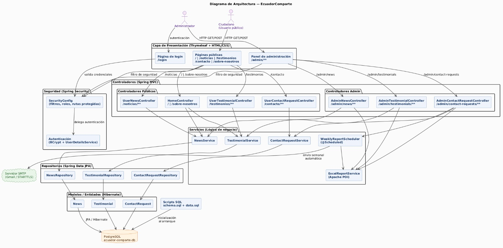

---

## Modelo Entidad/Relación (Base de Datos)

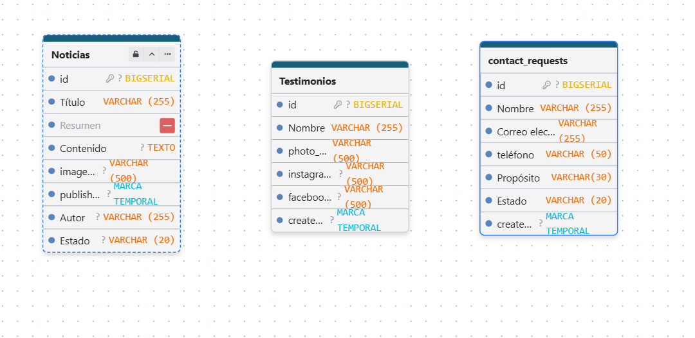

---

## Endpoints o Peticiones Disponibles

| Funcionalidad                        | Ruta                                  | Método     | Descripción                                                  |
|--------------------------------------|---------------------------------------|------------|--------------------------------------------------------------|
| Página de inicio                     | /                                     | GET        | Muestra noticias publicadas, testimonios y formulario        |
| Sobre Nosotros                       | /sobre-nosotros                       | GET        | Información institucional de la organización                 |
| Página de login                      | /login                                | GET        | Formulario de inicio de sesión del administrador             |
| Listado de noticias                  | /noticias                             | GET        | Muestra todas las noticias publicadas                        |
| Detalle de noticia                   | /noticias/{id}                        | GET        | Muestra el detalle de una noticia específica                 |
| Formulario de contacto               | /contacto                             | GET        | Página con el formulario de contacto ciudadano               |
| Enviar solicitud de contacto         | /contacto                             | POST       | Registra una solicitud de contacto en la base de datos       |
| Listado de testimonios               | /testimonios                          | GET        | Muestra todos los testimonios de la comunidad                |
| Admin - Dashboard                    | /admin                                | GET        | Panel principal de administración                            |
| Admin - Noticias                     | /admin/news                           | GET        | Lista todas las noticias (admin)                             |
| Admin - Exportar noticias Excel      | /admin/news/export/excel              | GET        | Descarga un Excel con todas las noticias                     |
| Admin - Crear noticia                | /admin/news/create                    | GET / POST | Formulario para crear una nueva noticia                      |
| Admin - Editar noticia               | /admin/news/edit/{id}                 | GET        | Formulario para editar una noticia existente                 |
| Admin - Eliminar noticia             | /admin/news/delete/{id}               | GET        | Elimina una noticia                                          |
| Admin - Testimonios                  | /admin/testimonials                   | GET        | Lista todos los testimonios (admin)                          |
| Admin - Exportar testimonios Excel   | /admin/testimonials/export/excel      | GET        | Descarga un Excel con todos los testimonios                  |
| Admin - Crear testimonio             | /admin/testimonials/create            | GET / POST | Formulario para crear un nuevo testimonio                    |
| Admin - Editar testimonio            | /admin/testimonials/edit/{id}         | GET        | Formulario para editar un testimonio existente               |
| Admin - Eliminar testimonio          | /admin/testimonials/delete/{id}       | GET        | Elimina un testimonio                                        |
| Admin - Solicitudes de contacto      | /admin/contact-requests               | GET        | Lista todas las solicitudes de contacto                      |
| Admin - Exportar solicitudes Excel   | /admin/contact-requests/export/excel  | GET        | Descarga un Excel con todas las solicitudes                  |
| Admin - Detalle de solicitud         | /admin/contact-requests/{id}          | GET        | Muestra el detalle de una solicitud de contacto              |
| Admin - Eliminar solicitud           | /admin/contact-requests/delete/{id}   | GET        | Elimina una solicitud de contacto                            |
| Admin - Enviar reporte ahora         | /admin/contact-requests/report/send-now | GET      | Fuerza el envío inmediato del reporte semanal por correo     |

---

## Stack de Tecnologías

### Backend

| Tecnología             | Versión                          |
|------------------------|----------------------------------|
| Java                   | 21                               |
| Spring Boot            | 4.0.5                            |
| Spring Security        | Incluido en Spring Boot 4.0.5    |
| Spring Data JPA        | Incluido en Spring Boot 4.0.5    |
| Hibernate              | Incluido en Spring Data JPA      |
| Thymeleaf              | Incluido en Spring Boot 4.0.5    |
| thymeleaf-extras-springsecurity6 | Incluido                |
| Spring Boot Mail       | Incluido en Spring Boot 4.0.5    |
| Apache POI (Excel)     | 5.3.0                            |

### Base de Datos

| Tecnología             | Versión                          |
|------------------------|----------------------------------|
| PostgreSQL             | 14+                              |
| Driver JDBC PostgreSQL | 42.7.3                           |

### Build y Herramientas

| Tecnología             | Versión                          |
|------------------------|----------------------------------|
| Gradle                 | Wrapper incluido                 |
| Spring Boot DevTools   | Incluido (solo desarrollo)       |
| JUnit                  | Incluido en spring-boot-starter-test |

### Frontend

| Tecnología | Descripción                             |
|------------|-----------------------------------------|
| HTML5      | Plantillas Thymeleaf                    |
| CSS3       | Estilos personalizados (styles.css, index-page.css) |

### Dependencias Gradle (`build.gradle`)

```groovy
dependencies {
    implementation 'org.springframework.boot:spring-boot-starter-web'
    implementation 'org.springframework.boot:spring-boot-starter-data-jpa'
    implementation 'org.springframework.boot:spring-boot-starter-security'
    implementation 'org.springframework.boot:spring-boot-starter-thymeleaf'
    implementation 'org.thymeleaf.extras:thymeleaf-extras-springsecurity6'
    implementation 'org.springframework.boot:spring-boot-starter-mail'
    implementation 'org.apache.poi:poi-ooxml:5.3.0'

    runtimeOnly 'org.postgresql:postgresql:42.7.3'

    testImplementation 'org.springframework.boot:spring-boot-starter-test'
    testImplementation 'org.springframework.security:spring-security-test'
    testRuntimeOnly 'org.junit.platform:junit-platform-launcher'
}
```

---

## Capturas UI/UX

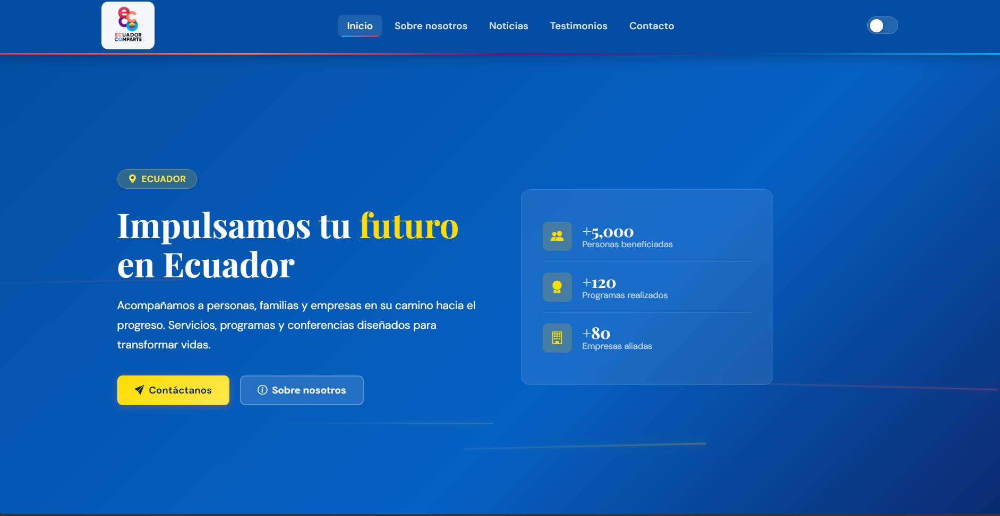
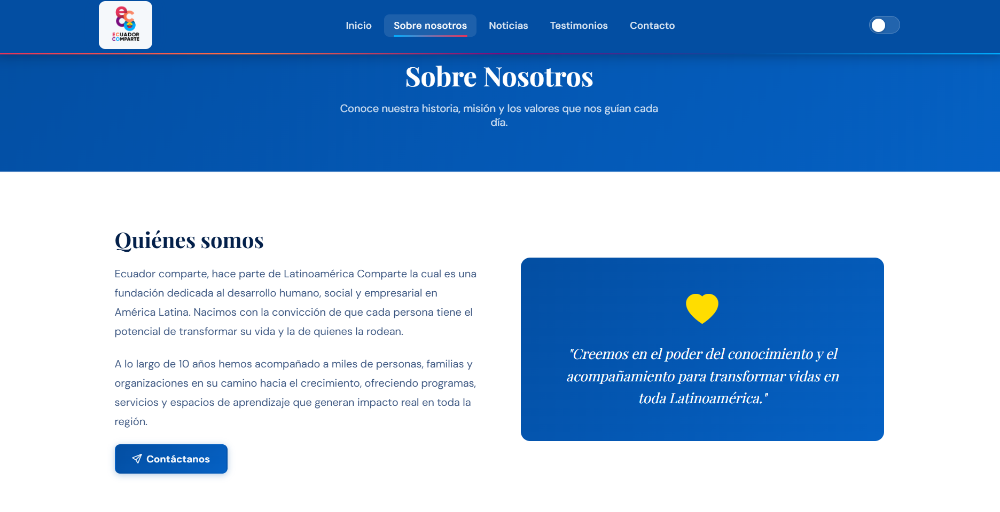
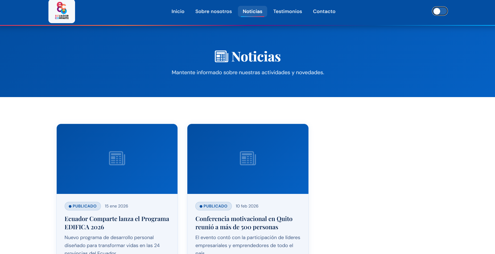
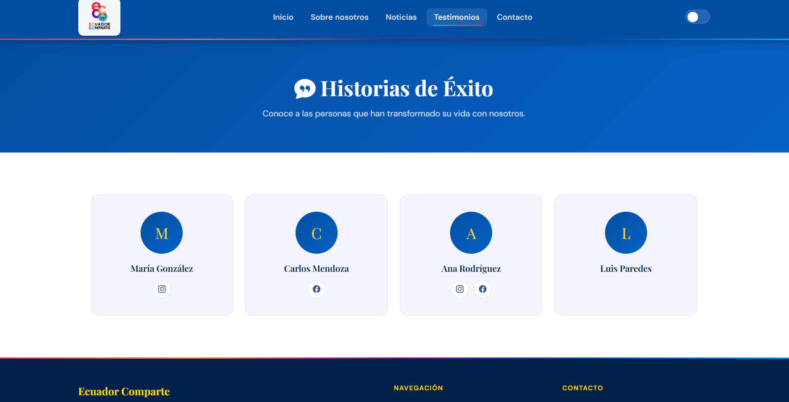
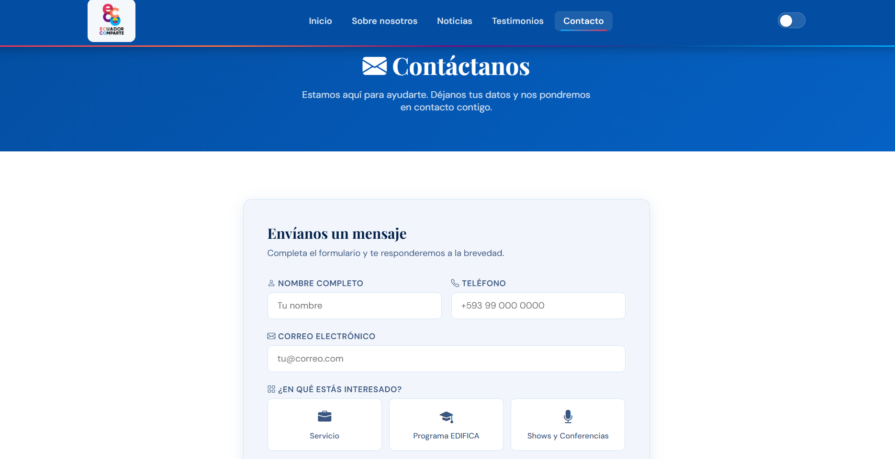
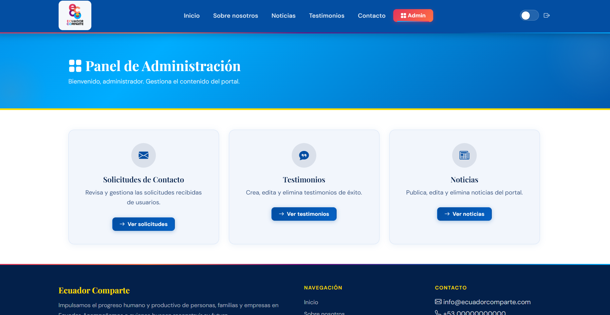
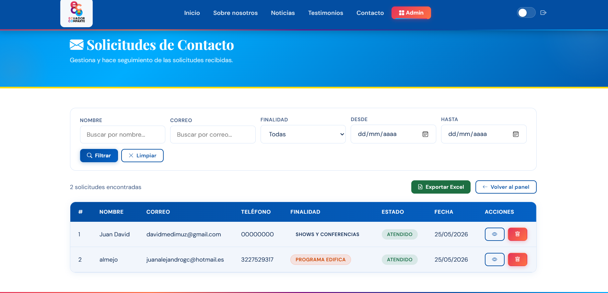
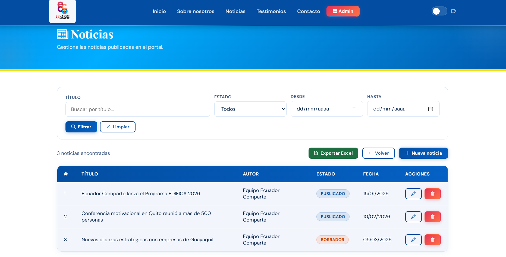
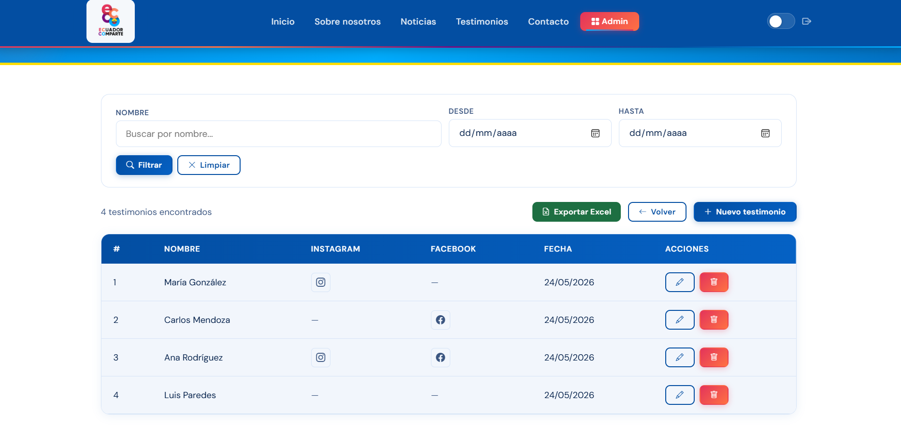
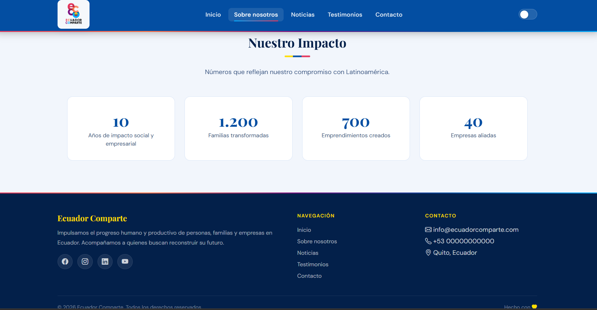

---

## Análisis Personal

### Retos encontrados

El desarrollo de EcuadorComparte nos enfrentó a situaciones técnicas que fueron mucho más complejas de lo que anticipamos al inicio del proyecto.

Uno de los retos más inesperados fue la integración del módulo de reportes por correo. Configurar Spring Mail con credenciales de aplicación de Gmail (en lugar de contraseñas convencionales), habilitar STARTTLS y asegurarnos de que el scheduler se ejecutara de forma confiable sin interferir con el ciclo de vida normal del servidor implicó mucha experimentación. Hubo momentos en que el envío del correo fallaba silenciosamente sin ningún mensaje de error claro, lo que nos obligó a leer a fondo los logs y entender cómo funciona la autenticación SMTP moderna.

La exportación a Excel usando Apache POI fue otro desafío real. Nunca habíamos trabajado con esta librería, y entender la diferencia entre Workbook, Sheet, Row y Cell, así como formatear correctamente los encabezados y los datos dinámicos desde JPA, nos tomó más tiempo del esperado. La dificultad aumentó al intentar que el archivo descargado se abriera correctamente en distintas versiones de Excel sin corrupción de datos.

La gestión de los scripts SQL (`schema.sql` y `data.sql`) también presentó complicaciones. Coordinar que Spring ejecutara primero el schema antes que los datos, y que las inserciones no se duplicaran en cada reinicio de la aplicación, requirió entender a fondo la propiedad `spring.sql.init.mode` y el orden de inicialización de contexto en Spring Boot.

### Aprendizajes técnicos más valiosos

Este proyecto nos dejó aprendizajes que van más allá del código.

El más importante fue comprender que una aplicación web real no termina en el CRUD básico. La inclusión de funcionalidades como reportes automáticos, exportaciones a Excel y autenticación segura nos mostró que las aplicaciones de producción tienen capas adicionales de complejidad que en los ejercicios del aula no siempre se practican. Aprender a usar Apache POI y Spring Scheduler nos dio herramientas muy prácticas para el mundo laboral.

También fue muy valioso profundizar en la separación real de responsabilidades dentro del patrón MVC. Mantener los controladores limpios de lógica de negocio, delegar todo el procesamiento a los servicios, y hacer que los repositorios sean el único punto de contacto con la base de datos, nos ayudó a escribir código más legible y mantenible. Cuando aparecían bugs, sabíamos exactamente en qué capa buscar.

Finalmente, trabajar con Spring Security nos cambió la perspectiva sobre cómo se diseña la seguridad. Entender que proteger rutas, encriptar contraseñas y separar los roles de usuario no son "extras opcionales" sino decisiones de arquitectura que se toman desde el primer día, es un aprendizaje que llevaremos a todos nuestros proyectos futuros.
